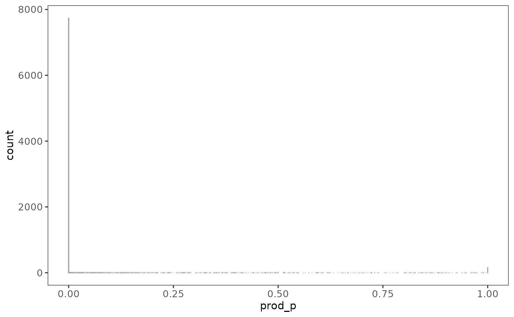
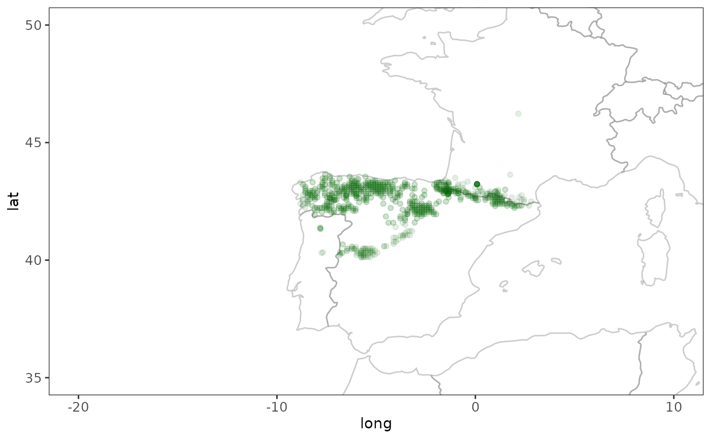
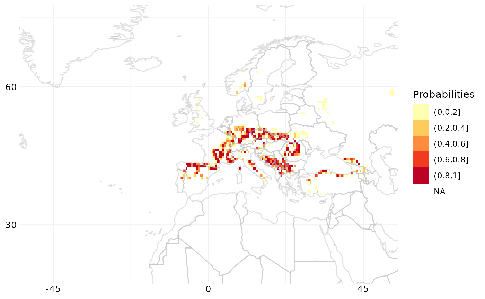

# 

## Using raquamaps

This vignette is a long form documentation included in the raquamaps R
package with the intention to describe some common usage scenarios, for
example:

- For a given species, calculate and generate a distribution map and
  output in csv format
- For a list of species, generate several maps and output in raster
  format

### Some useful packages to use with raquamaps

First some recommended R packages that are useful when working with
`raquamaps`, in order to facilitate plotting, data manipulation and data
retrieval:

``` r
# plotting
require("classInt")
require("ggplot2")
require("terra")
require("RColorBrewer")

# data modelling
# require("rgbif")
require("raquamaps")

# data manipulation
# require("plyr")
require("dplyr")
require("tidyr")

# we set our preference for how
# we choose to interpret string data
# throughout this tutorial
options(stringsAsFactors = FALSE)
```

### How to access and use the bundled reference data

This package comes with some bundled reference data that can be used for
demonstrational purposes and in off-line situations. For real use cases,
it is recommended to use on-line services or tools for getting
up-to-date reference data, such as the rgbif R package. How to get data
from rgbif for use in raquamaps will be covered later in this tutorial.

Before showing some convenience functions that simplify accessing
reference data, here is how you can access bundled reference datasets
directly:

``` r
# Inspect documentation for reference datasets
# that are bundled into the package with this ...

# data(package = "raquamaps")

# Get and print names of bundled datasets
# in the raquamaps package
datasets <- data(package = "raquamaps")$results[, "Item"]
print(datasets)
```

    ##  [1] "aquamaps_galemys_pyrenaicus"   "aquamaps_hc"                  
    ##  [3] "aquamaps_hcaf_eu"              "aquamaps_hcaf_world"          
    ##  [5] "aquamaps_presence_basins"      "aquamaps_presence_occurrences"
    ##  [7] "aquamaps_qc"                   "aquatic_hcaf"                 
    ##  [9] "rgbif_galemys_pyrenaicus"      "rgbif_great_white_shark"

``` r
# Load and unload one of the bundled datasets
# into your current  environment
data("aquamaps_galemys_pyrenaicus") # load
rm("aquamaps_galemys_pyrenaicus") # unload

# If you want to load a dataset into your own variable you can ...
# Define a helper function to load reference data from
# an R package as a data frame that displays nicely
get_data <- function(x) {
  tibble::as_tibble(get(data(list = x)))
}

# ... and use it to load a dataset into your own named variable
hcaf_eu <- get_data("aquamaps_hcaf_eu")
galemys <- get_data("aquamaps_galemys_pyrenaicus")

# Here we load the European cell authority fields, ie half degree cell
# data including geometry and an explicitly defined set of bioclimate
# variables
clim_vars <- c(
  "Elevation",
  "TempMonthM",
  "NPP",
  "SoilpH",
  "SoilMoistu",
  "PrecipAnMe",
  "CTI_Max",
  "SoilCarbon"
)

hcaf <-
  get_data("aquamaps_hcaf_eu") %>%
  # discard irrelevant fields
  # and rename the cell identifier column name to
  # harmonize with the other datasets
  dplyr::select(loiczid = LOICZID, one_of(clim_vars))

# Define a cleanup function, intended for use across columns
replace_9999 <- function(x) {
  ifelse(round(x) == -9999, NA, x)
}

# We apply the above cleanup function across columns, dplyr style
hcaf_eu <-
  hcaf %>%
  # recode values across climate variable columns
  # substitute -9999, use NA instead, exclude the "loiczid" column
  dplyr::mutate(dplyr::across(-loiczid, replace_9999))

hcaf_eu
```

    ## # A tibble: 8,593 × 9
    ##    loiczid Elevation TempMonthM     NPP SoilpH SoilMoistu PrecipAnMe CTI_Max
    ##      <int>     <dbl>      <dbl>   <dbl>  <dbl>      <dbl>      <dbl>   <dbl>
    ##  1  103418      475.         31 0.228     7.65      0.100       4.73    1777
    ##  2  102697      480.         31 0.228     7.69      0.150       4.19    2008
    ##  3  102698      432.         31 0.228     7.79      0.1         4.39    1814
    ##  4  103419      441.         31 0.207     7.64      0.1         4.99    1864
    ##  5  103420      411.         30 0.207     7.72      0.1         5.44    1897
    ##  6  102699      407.         31 0.207     7.80      0.1         4.6     1774
    ##  7  102700      386.         31 0.207     7.66      0.1         4.92    1564
    ##  8  101971      883.         30 0.00100   7.67      0.748       5.76    1666
    ##  9  101972      782.         30 0.00100   7.76      0.814       4.93    1556
    ## 10  101251      767.         30 0.00100   7.77      0.784       5.03    1737
    ## # ℹ 8,583 more rows
    ## # ℹ 1 more variable: SoilCarbon <dbl>

There are some convenient helper functions that simplifies access and
provides some relevant defaults for use with the demonstrational
reference data that is bundled in the package:

``` r
# Suggested set of bioclimate variables
clim_vars <- default_clim_vars()

# One specific species name - the default species - Galemys pyrenaicus
species <- default_species()

# Several species names available in the reference data
species_list <- default_species_list()

# European half degree cell reference data for some relevant bioclimate variables
hcaf_eu <- default_hcaf()

# Presence data for all species in the bundled
# reference data, including grid cell identifiers (loiczids)
presence_occs <- default_presence()

# Showing a "dplyr inspired way" to load presence data
# which demonstrates using dplyr API with a
# "pipe" operator that chains operations together sequentially,
# each step sending its output as input to the next step,
# going from left to right
presence_galemys <-
  default_presence() %>%
  filter(lname == default_species())

# Yet another way to display grid cell identifiers (loiczids)
# for the default species
presence_loiczids <-
  presence_occs %>%
  filter(lname == default_species()) %>%
  group_by(loiczid) %>%
  summarise(count = n()) %>%
  arrange(desc(count))

# Another variant on the same thing
presence_galemys_pyrenaicus <-
  presence_occs %>%
  # retain only records for a specific latin name
  filter(lname == "galemys pyrenaicus") %>%
  # in case of duplicate cell ids, retrieve only distinct ids
  distinct(loiczid) %>%
  #  group_by(loiczid) %>%
  dplyr::select(loiczid)

# Get a list of all latin names  for all species in the
# bundled occurrence dataset ordered with the species with
# the most dispersed distribution (ie highest number of distinct
# different cells) at the top
presence_occs %>%
  group_by(lname) %>%
  summarise(count = n_distinct(loiczid)) %>%
  arrange(desc(count)) %>%
  dplyr::select(species = lname, count)
```

    ## # A tibble: 110 × 2
    ##    species             count
    ##    <fct>               <int>
    ##  1 ardea cinerea        1793
    ##  2 gallinago gallinago  1450
    ##  3 riparia riparia      1444
    ##  4 aythya fuligula      1388
    ##  5 phalacrocorax carbo  1386
    ##  6 numenius arquata     1245
    ##  7 cinclus cinclus      1209
    ##  8 bucephala clangula   1204
    ##  9 gallinula chloropus  1162
    ## 10 mergus merganser     1158
    ## # ℹ 100 more rows

### Typical workflow

Now that we can retrieve presence data for one species using the bundled
reference data, we can show the workflow for calculating the
environmental envelope or spread values.

``` r
# We find bioclimate variable data from half degree cells
# where a specific species has been present
hcaf_galemys <- hcaf_by_species("galemys pyrenaicus")

# We determine the spreads across these particular grid cells
# ie calculate the environmental envelope for the species
spreads_galemys <- calc_spreads(hcaf_galemys)

# We can also use this wrapper function for convenience
calc_spreads_by_species("galemys pyrenaicus")
```

    ## # A tibble: 8 × 13
    ##   Measure     n n_distinct  n_NA   min   max    q1    q3    d1    d9 range   iqr
    ##   <chr>   <dbl>      <dbl> <dbl> <dbl> <dbl> <dbl> <dbl> <dbl> <dbl> <dbl> <dbl>
    ## 1 CTI_Max    76         71     0  1103  1878  1341  1528  1269  1618   775   187
    ## 2 Elevat…    76         76     0   229  1767   650  1068   478  1177  1538   418
    ## 3 NPP        76         28     0     0     1     0     1     0     1     1     0
    ## 4 Precip…    76         76     0    35   114    47    87    41   100    79    41
    ## 5 SoilCa…    76         68     0     4    10     5     8     5     9     6     3
    ## 6 SoilMo…    76         76     0    53   142    82   120    70   127    89    38
    ## 7 SoilpH     76         66     0     5     8     5     7     5     8     3     2
    ## 8 TempMo…    76         10     0    10    19    14    16    13    17     9     2
    ## # ℹ 1 more variable: idr <dbl>

Now, across various other half degree grid cells, where we have similar
bioclimate variable information available, we can calculate relative
probabilites for presence, assuming that similar spreads in the species’
environmental bioclimate variables would indicate a suitable habitat:

``` r
# Calculate probabilites across European grid cells,
# given this particular species preference for environmental envelopes
hcaf_eu <- default_hcaf()

# You can inspect the model used by inspecting the calc_prob and calc_probs
# functions, ie uncomment lines below and run in R to inspect the functions:
# calc_prob
# calc_probs
# You can see how prod_p is calculated in the calc_probs function, ie:
# prod_p = Elevation * TempMonthM * NPP * SoilpH *
#        SoilMoistu * PrecipAnMe * CTI_Max * SoilCarbon
# where those factors are individual p values determined by calc_prob using
# the spread or environmental envelope preference
probs <- calc_probs(hcaf_eu, spreads_galemys)

# TODO: Calculate across whole world
# hcaf_world <-
#   get_data("aquamaps_hcaf_world") %>%
#   rename(loiczid = LOICZID) %>%
#   select(loiczid, one_of(clim_vars))
# x <- as.numeric(hcaf_world$CTI_Max)
# x[is.na(x)] <- -9999
# x[x == ""] <- -9999
# hcaf_world$CTI_Max <- x
# hcaf_world$NPP <- runif(nrow(hcaf_world), min = 0, max = 1)
# system.time(
#   probs <- calc_probs(hcaf_world, spreads_galemys)
# )

# Define custom plot style to use in ggplot2 plots
theme_raquamaps <- function() {
  theme <- theme_bw() + theme(
    axis.text.x = element_text(size = 10),
    axis.text.y = element_text(size = 10),
    panel.background = element_blank(),
    plot.background = element_blank(),
    panel.grid.minor = element_blank(),
    panel.grid.major = element_blank()
  )
}

# Plot a histogram of the probabilities
ggplot(probs, aes(x = prod_p)) +
  theme_raquamaps() +
  geom_bar(fill = "darkgreen", colour = "darkgray")
```



### Using presence data from gbif

Instead of using the prepackaged reference data, you will probably want
to get data from GBIF. Here is an illustration of how to do this
conveniently by using the rgbif R package:

``` r
# Get presence data for Great White Shark from rgbif
# jagged_tooth <- "Carcharodon carcharias"
# gws <- presence_rgbif(jagged_tooth)
# gws <- get_data("rgbif_great_white_shark")
gws <- get_data("rgbif_galemys_pyrenaicus")

# Plot the point data, with a world map to provide context
world <- ggplot2::map_data("world")
ggplot(world, aes(x = long, y = lat, group = group)) +
  # paint country border
  geom_path(color = "gray50", alpha = 0.4) +
  # add general styling
  theme_raquamaps() +
  coord_cartesian() +
  # zoom in to Europe
  coord_cartesian(xlim = c(-20, 10), ylim = c(35, 50)) +
  # add point data
  geom_point(
    data = gws,
    aes(
      x = gws$decimalLongitude,
      y = gws$decimalLatitude, group = 0
    ),
    alpha = 0.1, color = "darkgreen"
  )
```

    ## Coordinate system already present.
    ## ℹ Adding new coordinate system, which will replace the existing one.

    ## Warning: Use of `gws$decimalLongitude` is discouraged.
    ## ℹ Use `decimalLongitude` instead.

    ## Warning: Use of `gws$decimalLatitude` is discouraged.
    ## ℹ Use `decimalLatitude` instead.

    ## Warning: Removed 293 rows containing missing values or values outside the scale range
    ## (`geom_point()`).



``` r
# We need at least 5 observations per half degree cell,
# and need to find those grid cells where the species is present
r <- rasterize_presence(gws)
loiczids <- which_cells_in_raster(r, 5)

hcaf_gws <-
  # use European half degree cell authority file
  default_hcaf() %>%
  # return only cells where there was presence
  filter(loiczid %in% loiczids)

# Now we know where this species is likely to be present
# and we determine the corresponding bioclimate variable parameter
# spread for the cells with known presence

spread_gws <- calc_spreads(hcaf_gws)

# Finally we calculate relative probabilities for presence in
# other cells, assuming that cells with similar "environmental envelope"
# is more likely to be a suitable habitat for this species

hcaf_eu <- default_hcaf()
p <- calc_probs(hcaf_eu, spread_gws)

# Using half degree cell grid data for the whole world
# TODO: unfortunately we miss bioclimate variable data for the full
# world grid, this should be added
hdc_world <-
  tibble::as_tibble(get(data("aquamaps_hc"))) %>%
  dplyr::mutate(loiczid = LOICZID) %>%
  dplyr::select(-LOICZID)
rownames(hdc_world) <- hdc_world$loiczid
```

    ## Warning: Setting row names on a tibble is deprecated.

``` r
# TODO: Ask Sven K for reasonable habitat
```

### Exporting results in raster format

You can now proceed to visualize this data in raster format like so:

``` r
# Put the probabilities into a raster layer
r <- terra::rast(ncol = 720, nrow = 360)
r[p$loiczid] <- p$prod_p

# Convert raster layer data to a data frame
# to simplify plotting with ggplot2
crds <- terra::crds(r, na.rm = FALSE)
df <- data.frame(x = crds[, 1], y = crds[, 2], p = terra::values(r, mat = FALSE))

# Shows how to use Fisher-Jenks style class intervals
# for coloring in the plot
fisher_intervals <- classIntervals(df$p, n = 5, style = "fisher")
```

    ## Warning in classIntervals(df$p, n = 5, style = "fisher"): var has missing
    ## values, omitted in finding classes

``` r
p_steps <- cut(df$p, breaks = fisher_intervals$brks)

# For now we just go with a standard five-stepped
# sequential color scheme
breakpoints <- c(0, 0.2, 0.4, 0.6, 0.8, 1)
colors <- brewer.pal(5, "YlOrRd")
p_steps <- cut(df$p, breaks = breakpoints)

# Plot raster data along with the world map
map_gws <-
  ggplot(world, aes(x = long, y = lat, group = group)) +
  # zoom in to Europe
  coord_cartesian(xlim = c(-50, 50), ylim = c(20, 75)) +
  # use specific styling
  theme_bw() +
  theme(
    axis.text.x = element_text(size = 10),
    axis.text.y = element_text(size = 10),
    panel.background = element_blank(),
    plot.background = element_blank(),
    panel.grid.minor = element_line(colour = "gray95"),
    panel.grid.major = element_line(colour = "gray95"),
    axis.text = element_blank(),
    axis.ticks = element_blank(),
    axis.line = element_blank(),
    axis.title = element_blank(),
    panel.border = element_blank()
  ) +
  # add the raster data that was converted to a data frame earlier
  geom_raster(data = df, aes(x, y, fill = p_steps, group = NULL)) +
  # this determines colors used, inspired by aquamaps.org
  scale_fill_brewer(type = "seq", palette = "YlOrRd", name = "Probabilities") +
  # outline country border with a light gray color
  geom_path(color = "gray70", alpha = 0.4) +
  # add grid lines to the map
  scale_y_continuous(breaks = (-2:2) * 30) +
  scale_x_continuous(breaks = (-4:4) * 45)

# We now display this plot
map_gws
```

    ## Warning: Removed 258596 rows containing missing values or values outside the scale range
    ## (`geom_raster()`).



``` r
# To export this map, ggsave can be used
# ggsave(filename = "map.png", plot = map_gws,
#       width = 5, height = 4, units = "cm")

# To export the raster data one can save the raster
# or export the corresponding data frame to csv, like so:
# write.csv2(tbl_df(df), file = "rasterdata.csv")
```

### Batch calculation of spreads and probabilites

``` r
# Calculate spreads for several species at once
# dplyr style, limit calculation to top 10 species
species_list %>%
  filter(count > 100) %>%
  head(10) %>%
  group_by(species) %>%
  group_modify(~ calc_spreads_by_species(.y$species))
```

    ## # A tibble: 80 × 14
    ## # Groups:   species [10]
    ##    species    Measure     n n_distinct  n_NA   min   max    q1    q3    d1    d9
    ##    <fct>      <chr>   <dbl>      <dbl> <dbl> <dbl> <dbl> <dbl> <dbl> <dbl> <dbl>
    ##  1 ardea cin… CTI_Max  1541        761     0   597  2272  1383  1686  1219  1837
    ##  2 ardea cin… Elevat…  1541       1518     0     1  2323   104   484    44   811
    ##  3 ardea cin… NPP      1541        361     0 -9999     1     0     1     0     1
    ##  4 ardea cin… Precip…  1541       1326     0     0   229    48    69    41    96
    ##  5 ardea cin… SoilCa…  1541       1191     0 -9999    19     5    10     4    12
    ##  6 ardea cin… SoilMo…  1541       1523     0     0   150    75   114    59   136
    ##  7 ardea cin… SoilpH   1541       1010     0 -9999     8     5     6     5     7
    ##  8 ardea cin… TempMo…  1541         32     0     0    35    12    16     9    20
    ##  9 aythya fu… CTI_Max  1208        652     0   723  2221  1365  1653  1201  1782
    ## 10 aythya fu… Elevat…  1208       1199     0 -9999  1933   101   429    44   751
    ## # ℹ 70 more rows
    ## # ℹ 3 more variables: range <dbl>, iqr <dbl>, idr <dbl>

``` r
# Create a function to wrap several steps into one
# first calculate environmental envelope for a species
# then calculate probabilities across European grid

calc_probs_species <- function(.latinname) {
  #  hcaf_species <- hcaf_by_species(.latinname)
  spreads_species <- calc_spreads_by_species(.latinname)
  hcaf_eu <- default_hcaf()
  probs <- tibble::as_tibble(calc_probs(hcaf_eu, spreads_species))
  return(probs)
}

# Now we use the function above to calculate probabilities
# for just one species
calc_probs_species(species_list$species[2])
```

    ## # A tibble: 8,593 × 11
    ##    loiczid Elevation TempMonthM   NPP SoilpH SoilMoistu PrecipAnMe CTI_Max
    ##      <int>     <dbl>      <dbl> <dbl>  <dbl>      <dbl>      <dbl>   <dbl>
    ##  1  103418     1          0.211     1  0.348    0.00160      0.118   0.953
    ##  2  102697     1          0.211     1  0.314    0.00239      0.105   0.229
    ##  3  102698     1          0.211     1  0.208    0.00159      0.110   0.837
    ##  4  103419     1          0.211     1  0.357    0.00159      0.125   0.680
    ##  5  103420     1          0.263     1  0.275    0.00159      0.136   0.577
    ##  6  102699     1          0.211     1  0.203    0.00159      0.115   0.962
    ##  7  102700     1          0.211     1  0.335    0.00159      0.123   1    
    ##  8  101971     0.859      0.263     1  0.33     0.0119       0.144   1    
    ##  9  101972     0.941      0.263     1  0.235    0.0129       0.123   1    
    ## 10  101251     0.953      0.263     1  0.230    0.0125       0.126   1    
    ## # ℹ 8,583 more rows
    ## # ℹ 3 more variables: SoilCarbon <dbl>, prod_p <dbl>, geomprod_p <dbl>

``` r
# However, we want to use the function above now
# to calculate probabilities for several species,
# Here is how we do that, dplyr style, including
# how to limit to 10 species in one batch calculation
batch_of_ten <-
  species_list %>%
  head(10) %>%
  group_by(species) %>%
  group_modify(~ calc_probs_species(.y$species))
```

### Getting native range maps data from aquamaps.org

Due to curl requests for aquamaps.org timing out during automated
builds, the R code below is not executed when building this vignette.

``` console
# Get the authoritative native range map for cod
# from aquamaps.org as a data frame
atlantic_cod <- nativerange("Gadus morhua")
print(atlantic_cod)
black_cod <- nativerange("Anoplopoma fimbria")
print(black_cod)

# Get native range map data from several species 
# of cod and combine into one dataframe
my_latinnames <- c("Anoplopoma fimbria", "Gadus morhua")
native_range_maps <- lapply(my_latinnames, nativerange)
combined <- rbind_all(native_range_maps)
print(combined)

# TODO - nice maps for the above datasets
```

### TODO: Restrict output certain areas

### TODO: More illustrations of various common use cases

``` r
# How to merge several species into one
# say we have two synonyms, use this technique
# which_cells(c("galemys pyrenaicus", "mergus merganser"))
```
