# 

## The Great White Shark

Let us start with getting some data points for the great white shark. We
could use `rgbif` to get it from an online data source, ensuring
up-to-date data. Here we chose to load persisted data from within this
package to enable off-line use.

``` r
# in this session we need a few packages
# for data manipulation, raster operations
# and we load raquamaps, of course
require("ggplot2")
require("leaflet")
require("dplyr")
require("terra")
require("raquamaps")

# helper to load data from the package
get_data <- function(x) tibble::as_tibble(get(data(list = x)))

# get occurrence data (points) for The Great White Shark
o <- get_data("rgbif_great_white_shark")

o
```

    ## # A tibble: 932 × 5
    ##    decimalLatitude decimalLongitude geodeticDatum countryCode vernacularName
    ##              <dbl>            <dbl> <chr>         <chr>       <chr>         
    ##  1          -40.7            145.   WGS84         AU          NA            
    ##  2          -46.9            168.   WGS84         NZ          NA            
    ##  3          -46.9            168.   WGS84         NZ          NA            
    ##  4            6.35             2.43 WGS84         BJ          NA            
    ##  5            6.38             2.62 WGS84         BJ          NA            
    ##  6            6.28             1.83 WGS84         BJ          NA            
    ##  7            6.23             1.68 WGS84         BJ          NA            
    ##  8            6.32             2.1  WGS84         BJ          NA            
    ##  9          -34.6             19.2  WGS84         ZA          NA            
    ## 10           28.2           -115.   WGS84         MX          NA            
    ## # ℹ 922 more rows

We now have the point data loaded and want to have an overview and
perhaps identify outlier or obviously erroneous points, and weed those
out.

``` r
occs_ggmap_points(o)
```

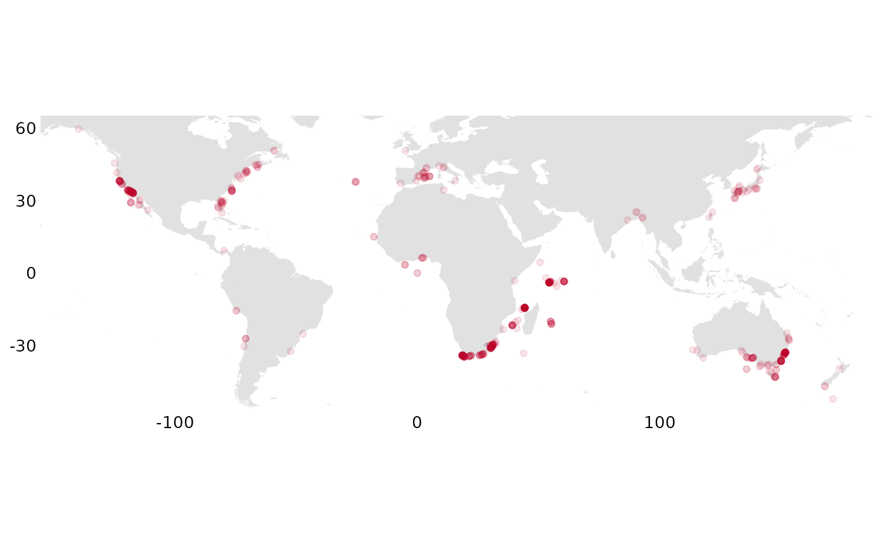

It looks ok, so we want to convert to a grid, “rasterizing” it,
summarizing occurrencies across grid cells

``` r
r <- rasterize_occs(o)
```

We now inspect this on a map:

``` r
# occs_ggmap_gridded_polys(r)
occs_ggmap_gridded(r, legend = FALSE)
```

    ## S4 class 'SpatRaster' [package "terra"]

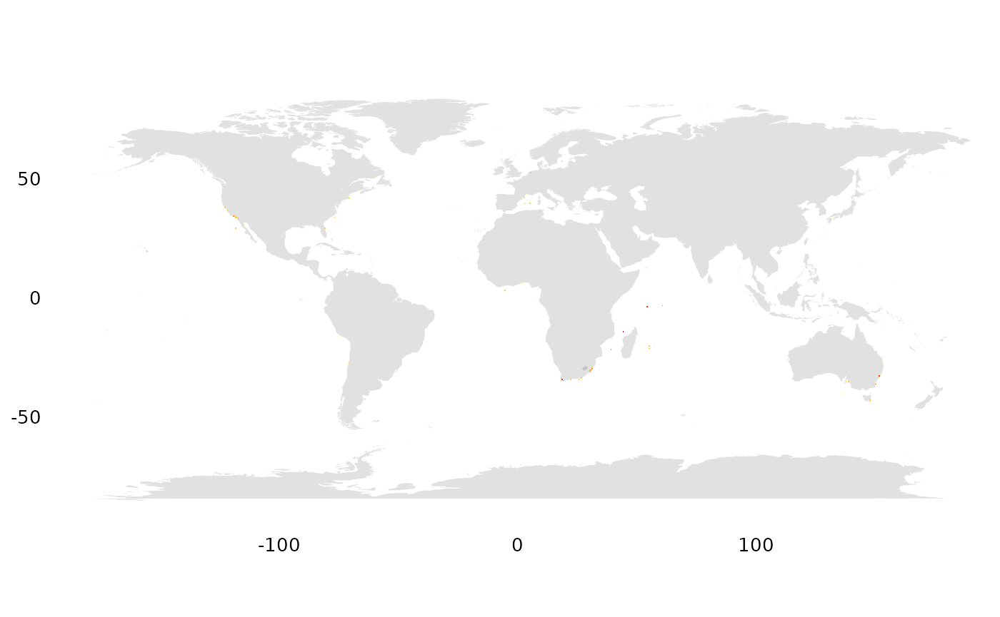

We immediately find that it is hard to see such small pixels (half
degree cells)… and want to zoom in.

``` r
geocode <- function(geoname) {
  geoname |>
    geocode_nominatim() |>
    dplyr::select(any_of(c("lat", "lon"))) |>
    dplyr::mutate(across(everything(), as.double)) |>
    dplyr::select(c("lon", "lat"))
}

# are there observations outside Cape Town?
p <- geocode("Cape Town")
occs_ggmap_gridded(r, center = p, padding = 15)
```

    ## S4 class 'SpatRaster' [package "terra"]

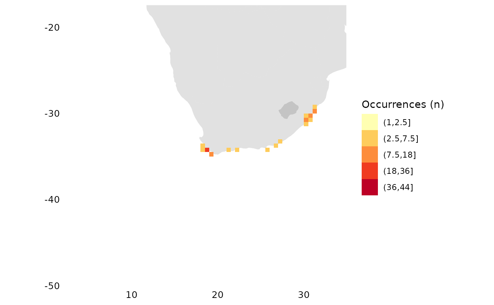

``` r
# what about outside SF?
p <- geocode("San Francisco")
occs_ggmap_gridded(r, center = p, padding = 20)
```

    ## S4 class 'SpatRaster' [package "terra"]

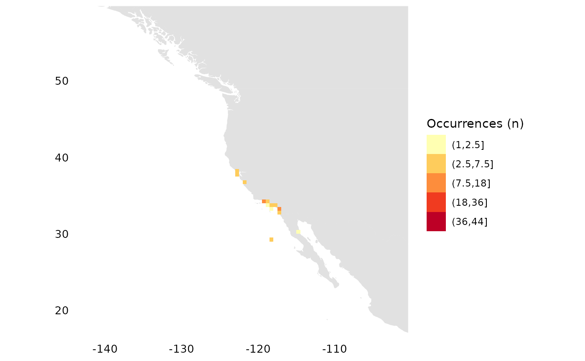

``` r
# around the Seychelles?
p <- geocode("Seychelles")
occs_ggmap_gridded(r, center = p, padding = 30)
```

    ## S4 class 'SpatRaster' [package "terra"]

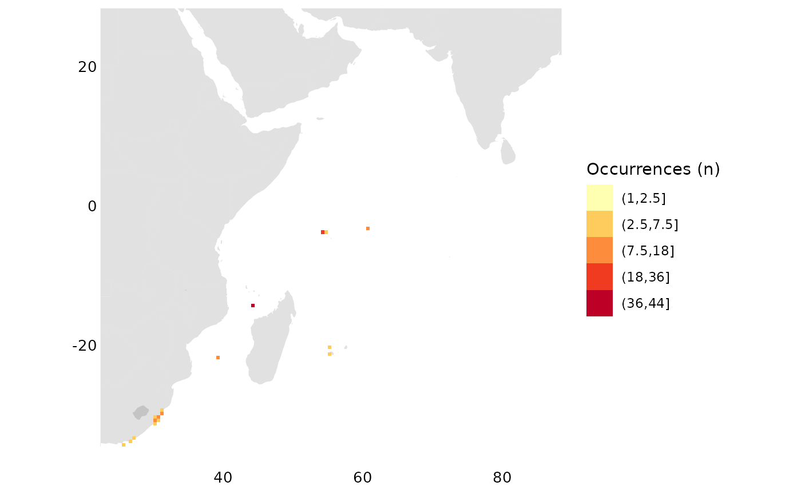

``` r
# Australian East-Coast?
p <- geocode("Surfer's Paradise, Australia")
occs_ggmap_gridded(r, center = p, padding = 10)
```

    ## S4 class 'SpatRaster' [package "terra"]

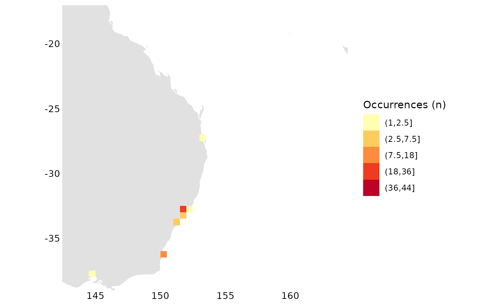

To really be able to zoom and check out details we use the web map
instead, where we can zoom in on all the locations above

``` r
occs_webmap_gridded(terra::trim(r))
```

## The European Amphibian

Now lets look at point data from an European amphibian:

``` r
o <- get_data("rgbif_galemys_pyrenaicus")
occs_ggmap_points(o)
```

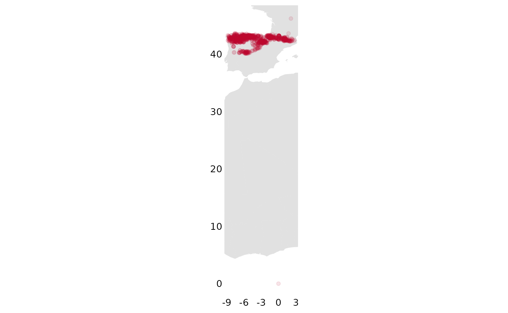

Here we check visually for outliers and note that this looks strange, it
seems some point is included from way down in Africa:

``` r
ggplot2::ggplot(o, ggplot2::aes(x = decimalLatitude, y = decimalLongitude)) +
  ggplot2::geom_point(alpha = 0.4) +
  ggplot2::labs(x = "", y = "")
```

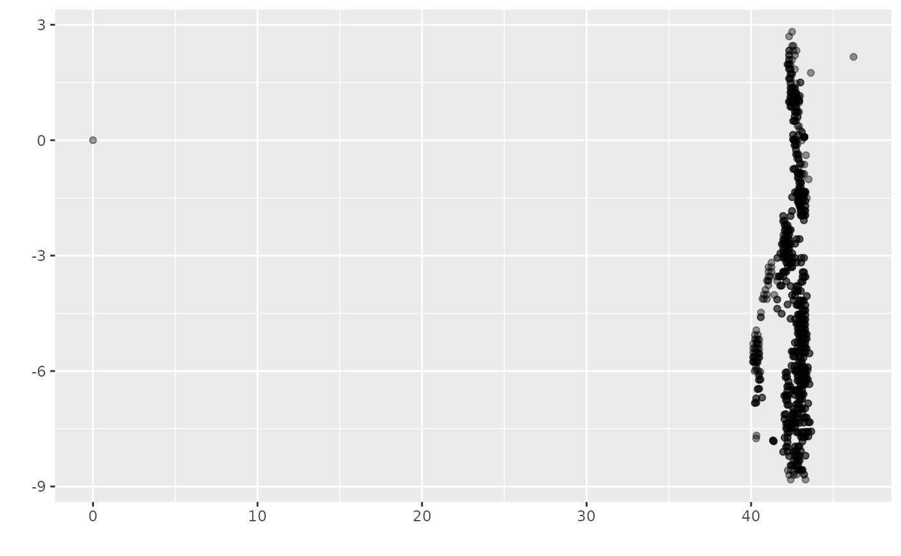

We proceed to remove outliers. In this case we remove 0, 0 (seems to be
a data error?) and everything above lat \> 45

``` r
o <- o %>%
  filter((!is.na(decimalLatitude)), (!is.na(decimalLongitude))) %>%
  filter(!(decimalLatitude == 0 & decimalLongitude == 0)) %>%
  filter(decimalLatitude < 45)

# look at histograms for coordinates for a sanity check
hist(o$decimalLatitude)
```

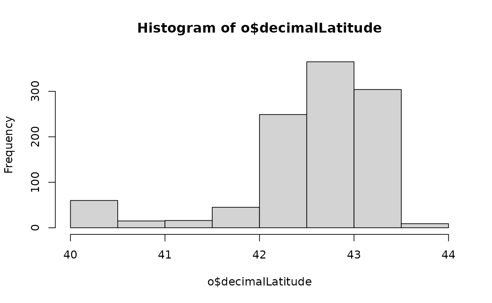

``` r
hist(o$decimalLongitude)
```

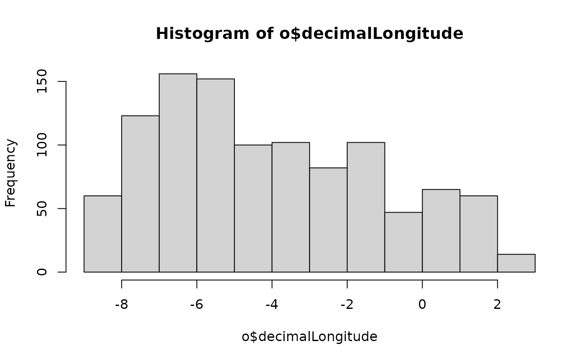

``` r
# compile the summary grid,
# trim the grid and map it
r <- rasterize_occs(o)
occs_ggmap_gridded(terra::trim(r), legend = FALSE)
```

    ## S4 class 'SpatRaster' [package "terra"]

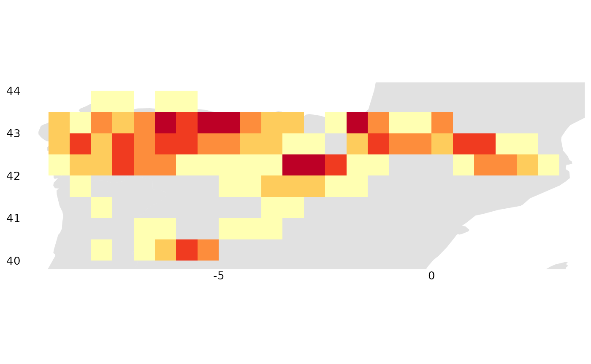

``` r
occs_ggmap_gridded(terra::trim(r), legend_title = "Galemys pyrenaicus (n)")
```

    ## S4 class 'SpatRaster' [package "terra"]

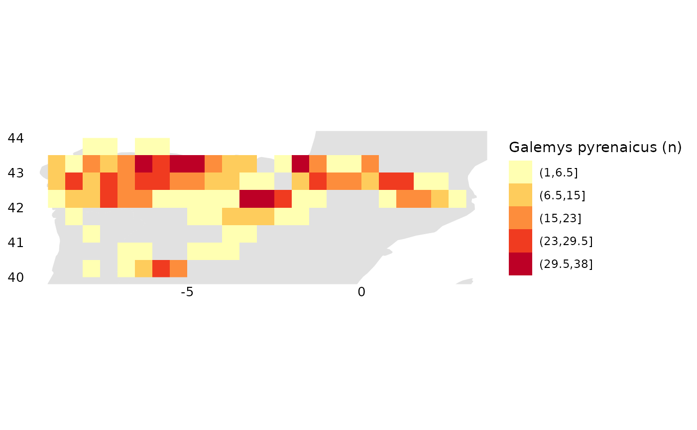

Here are a few ways to sanity check the raster data:

``` r
# look at frequencies of different values represented in the raster
terra::freq(r)
```

    ##    layer value count
    ## 1      1     1     3
    ## 2      1     2    18
    ## 3      1     3     3
    ## 4      1     4     8
    ## 5      1     5     3
    ## 6      1     6     5
    ## 7      1     7     2
    ## 8      1     8     3
    ## 9      1     9     1
    ## 10     1    10     3
    ## 11     1    12     5
    ## 12     1    13     2
    ## 13     1    14     1
    ## 14     1    16     3
    ## 15     1    17     1
    ## 16     1    18     5
    ## 17     1    19     2
    ## 18     1    20     3
    ## 19     1    21     1
    ## 20     1    25     3
    ## 21     1    26     3
    ## 22     1    27     1
    ## 23     1    28     3
    ## 24     1    29     1
    ## 25     1    30     2
    ## 26     1    31     2
    ## 27     1    34     1
    ## 28     1    38     1

``` r
# look at a histogram of values in the raster
hist(terra::values(r, mat = FALSE), xlab = "count", main = "")
```

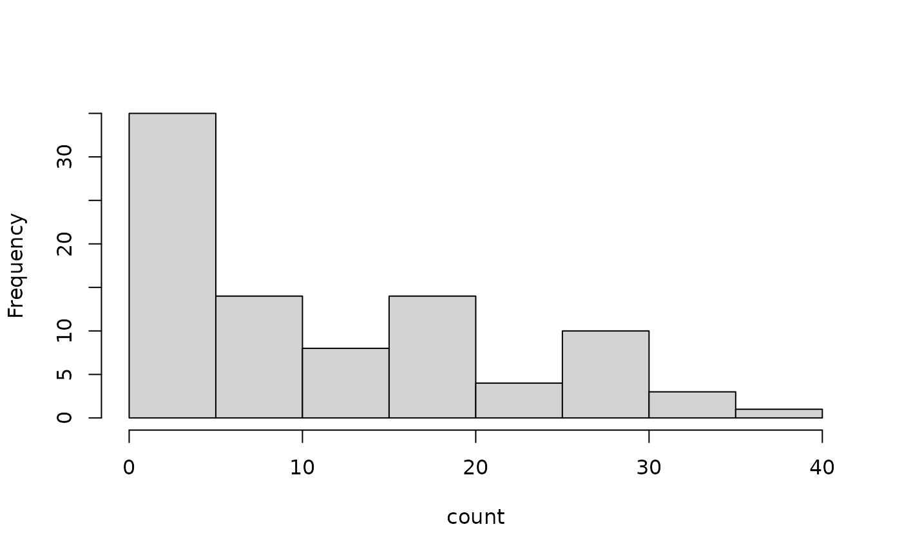

``` r
# quickly plot the raster
terra::plot(terra::trim(r))
```

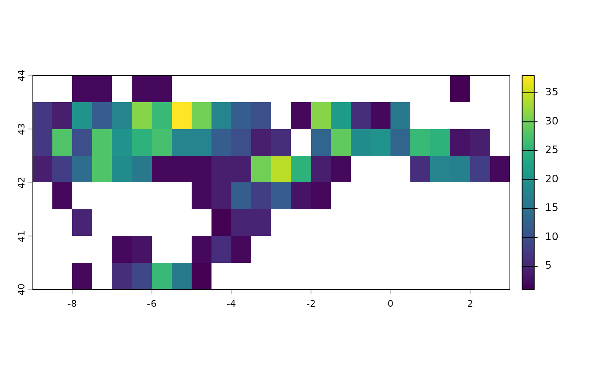

``` r
# spplot(trim(r))
# quantile(r, na.rm = TRUE)
```
